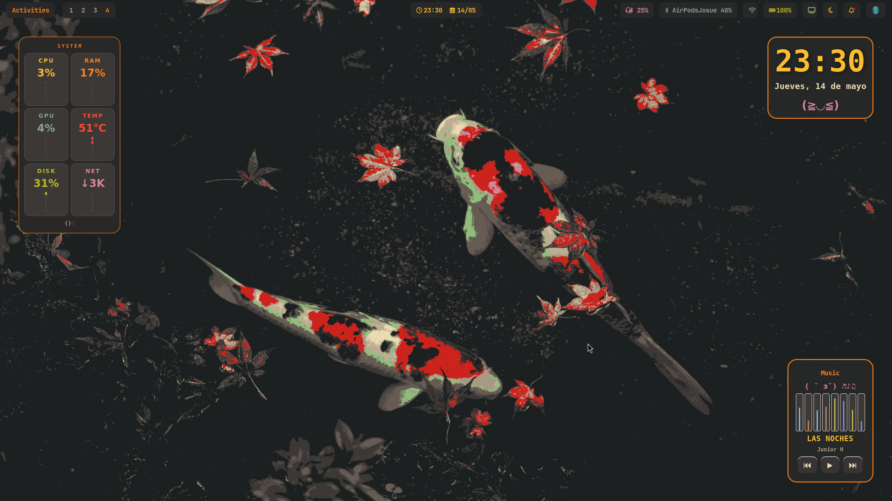
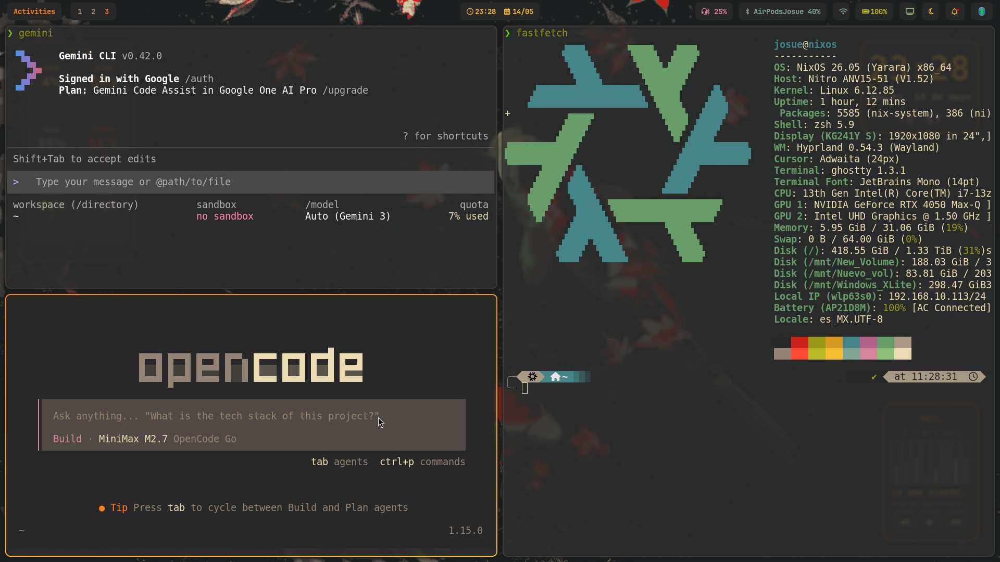
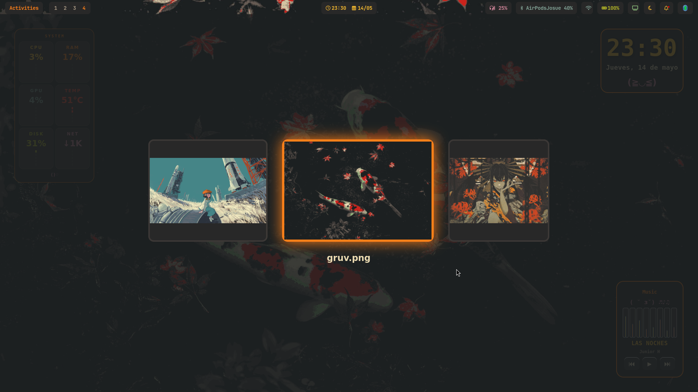

# 🌲 NixOS Dotfiles (Gruvbox Style)

¡Bienvenido a mi configuración personal de NixOS con Hyprland! Este setup está diseñado para ser estético, funcional y optimizado para hardware híbrido (Intel/NVIDIA), siguiendo una paleta de colores **Gruvbox** con un toque moderno estilo GNOME.

---

## 📸 Screenshots

### 🖥️ Escritorio Principal

*Hyprland con Waybar, widgets personalizados y estética limpia.*

### 🛠️ Terminal & Herramientas AI

*Setup de terminal con Gemini CLI, OpenCode y Fastfetch.*

### 🖼️ Menú de Wallpapers

*Selector dinámico de fondos de pantalla.*

---

## ✨ Características Principales

- **Window Manager**: [Hyprland](https://hyprland.org/) con animaciones fluidas.
- **Barra**: Waybar personalizada con indicadores de sistema.
- **Terminales**: Ghostty y Warp Terminal.
- **Widgets**: Kawaii widgets escritos en Python (Reloj, Monitor de sistema, Spotify).
- **Control de GPU**: Scripts automáticos para gestión de NVIDIA (Hotplug HDMI).
- **Estética**: Gruvbox Dark Hard.
- **Herramientas AI**: Integración con Gemini CLI y OpenCode.

---

## 🚀 Instalación

Este repositorio está diseñado para gestionarse de forma manual mediante enlaces simbólicos (sin Home Manager), para mantener el control total sobre los archivos.

### 1. Clonar el repositorio
```bash
git clone https://github.com/TU_USUARIO/dotfiles.git ~/dotfiles
cd ~/dotfiles
```

### 2. Ejecutar el instalador
He creado un script que se encarga de hacer los backups de tu configuración actual y crear los enlaces simbólicos a este repo:

```bash
chmod +x install.sh
./install.sh
```

### 3. Configuración de NixOS
Asegúrate de tener los paquetes necesarios instalados en tu `/etc/nixos/configuration.nix`. Puedes basarte en mi repositorio privado `nixos-config` para ver las dependencias exactas.

---

## ⌨️ Atajos de Teclado Clave

- `Super + Return` ⮕ Abrir Terminal (Warp)
- `Super + T` ⮕ Abrir Ghostty
- `Super + Space` ⮕ Lanzador de aplicaciones (nwg-drawer)
- `Super + E` ⮕ Explorador de archivos (Nautilus)
- `Super + Q` ⮕ Cerrar ventana
- `Super + W` ⮕ Cambiar Wallpaper
- `Super + Shift + S` ⮕ Captura de pantalla (área seleccionada)

---

## 🛠️ Estructura del Proyecto

```text
~/dotfiles/
├── .config/
│   ├── hypr/        # Configuración principal de Hyprland y Scripts
│   ├── waybar/      # Estilos y configuración de la barra
│   ├── swaync/      # Centro de notificaciones
│   └── ...          # Otros configs (Ghostty, GTK, etc.)
├── Imagenes/        # Wallpapers y Screenshots del README
├── install.sh       # Script de instalación
└── .zshrc / .bashrc # Configuraciones de la Shell
```

---

Hecho con ❤️ por Josué. Si te gusta este setup, ¡no olvides darle una ⭐️ al repo!
